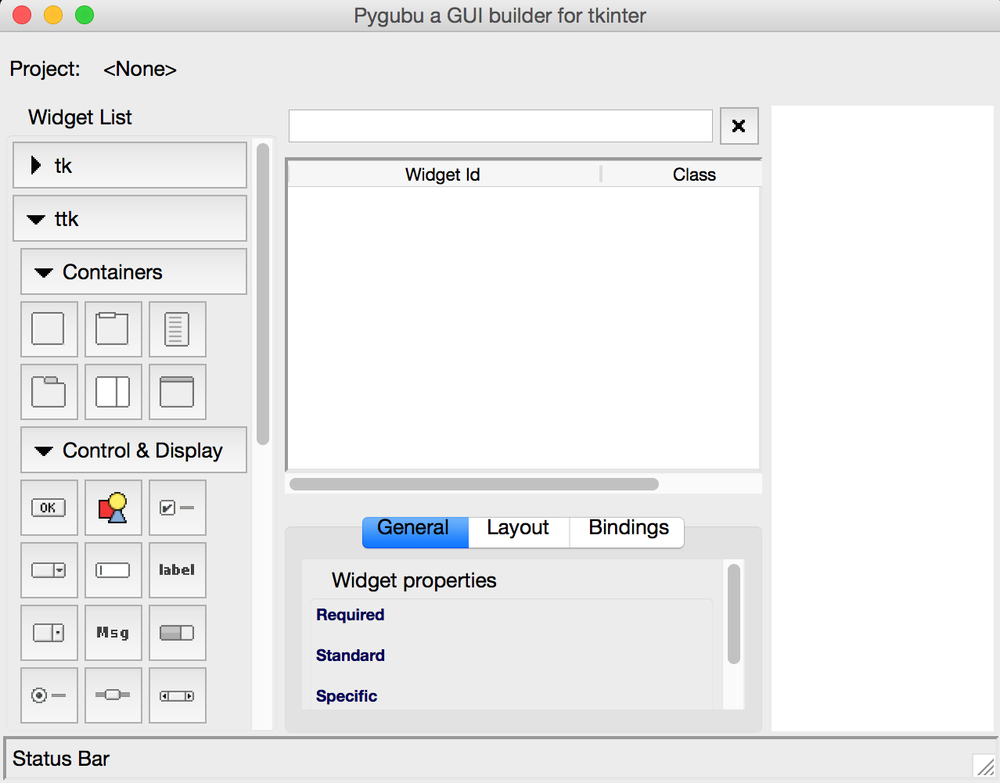

[](https://travis-ci.org/alejandroautalan/pygubu)

Bienvenido a Pygubu!
============================================

Pygubu es una [herramienta RAD](https://es.wikipedia.org/wiki/Desarrollo_r%C3%A1pido_de_aplicaciones) que permite _desarrollar interfaces de usuario rápida y fácilmente_ para el modulo tkinter de Python.

La interfaces diseñadas se guardan como archivos [XML](https://es.wikipedia.org/wiki/Extensible_Markup_Language), y usando el _constructor de pygubu_ estos pueden ser cargados dinámicamente por las aplicaciones
a medida que lo necesiten.

Pygubu esta inspirado por [Glade](https://es.wikipedia.org/wiki/Glade) (el diseñador de interfaces de gtk).

Instalación
============

Pygubu requiere python >= 2.7 (Probado solo en python 2.7.3 y 3.2.3 con tk8.5)

Puedes instalar pygubu usando:

### paquete zip:

Descarga y descomprime el paquete fuente. Abre una consola en el directorio de
extracción y ejecuta:

```
python setup.py install
```

### pip:

```
pip install pygubu
```

Ten en cuenta que si estas usando Python 3, debes usar su versión de la herramienta `pip`, por ejemplo:

    pip3.5 install pygubu

En el caso anterior, estoy usando la herramienta `pip` de Python 3.5.


Para verificar que la instalación se completó correctamente, puedes intentar importar `pygubu` (por ejemplo desde [IDLE](https://en.wikipedia.org/wiki/IDLE_(Python)))

    import pygubu
    
Si no tienes un error de importación ([`ImportError`](https://docs.python.org/3.5/library/exceptions.html#ImportError)), entonces la instalación fue exitosa.

Modo de uso
===========

Ejecuta el diseñador ejecutando en una consola los siguientes comandos, dependiendo del sistema operativo que uses.

### Sistemas tipo Unix:

```
pygubu-designer
```

### Windows:

```
c:\Python34\Scripts\pygubu-designer.exe
```

Donde 'c:\Python34' es **tu** directorio de instalación de python.

> **Nota:** para versiones anteriores a la **0.9.8** el script ejecutable se llamaba _**pygubu-designer.bat**_

Luego de esto la ventana del diseñador debería aparecer:




Ahora, puedes comenzar a crear tu aplicación tkinter usando los widgets que encontrarás en el panel izquierdo denominado `Lista de widgets`.

Luego de finalizar la creación de tu _interface de usuario_, grabala en un archivo`.ui` con la opción `Archivo > Guardar` del menu principal.

El siguiente es un ejemplo de interfaz de usuario denominado [holamundo.ui] (examples/holamundo.ui) creado usando pygubu-designer:

```xml
<?xml version='1.0' encoding='utf-8'?>
<interface>
  <object class="ttk.Frame" id="mainframe">
    <property name="height">200</property>
    <property name="padding">20</property>
    <property name="width">200</property>
    <layout>
      <property name="column">0</property>
      <property name="propagate">True</property>
      <property name="row">0</property>
      <property name="sticky">nesw</property>
    </layout>
    <child>
      <object class="ttk.Label" id="label1">
        <property name="anchor">center</property>
        <property name="font">Helvetica 26</property>
        <property name="foreground">#0000b8</property>
        <property name="text" translatable="yes">Hola Mundo !</property>
        <layout>
          <property name="column">0</property>
          <property name="propagate">True</property>
          <property name="row">0</property>
        </layout>
      </object>
    </child>
  </object>
</interface>
```

Luego, crea tu _aplicación_ como se muestra a continuación:

```python
#prueba.py
try:
    import tkinter as tk  # for python 3
except:
    import Tkinter as tk  # for python 2
import pygubu


class Application:
    def __init__(self, master):

        #1: Crea un constructor
        self.builder = builder = pygubu.Builder()

        #2: Carga un archivo con el diseño de la interfaz
        builder.add_from_file('holamundo.ui')

        #3: Crea el widget usando 'master' como padre
        self.mainwindow = builder.get_object('mainframe', master)


if __name__ == '__main__':
    root = tk.Tk()
    app = Application(root)
    root.mainloop()
```

Ten en cuenta que en lugar de `holamundo.ui` en la línea:

```python
builder.add_from_file('holamundo.ui')
```

Debes insertar el _nombre de archivo_ (o path) de la interfaz de usuario que acabas de grabar.


Ten en cuenta además que en lugar de `'mainframe'` en la línea:

```python
self.mainwindow = builder.get_object('mainframe', master)
```

Debes tener el nombre del _widget principal_ (el padre de todos los widgets), en caso contrario obtendras un error similar al siguiente::

    Exception: Widget not defined.

Mira [este](https://github.com/alejandroautalan/pygubu/issues/40) issue para mayor información.


Documentación
=============

Visita la [wiki](https://github.com/alejandroautalan/pygubu/wiki) para mas documentación.

Los siguientes links son buenas referencias (en inglés) de tkinter (y tk):

- [TkDocs](http://www.tkdocs.com)
- [Graphical User Interfaces with Tk](http://docs.python.org/3.5/library/tk.html)
- [Tkinter 8.5 reference: a GUI for Python](https://web.archive.org/web/20181211092656/http://infohost.nmt.edu/~shipman/soft/tkinter/web/index.html)
- [An Introduction to Tkinter](http://effbot.org/tkinterbook/)
- [Tcl/Tk 8.5 Manual](http://www.tcl.tk/man/tcl8.5/)

Tambien puedes buscar en el directorio de [ejemplos](examples) o mirar este ejemplo de 'Hola mundo' en
[vídeo](http://youtu.be/wuzV9P8geDg)


Historia
========

Mira la lista de cambios [aquí](HISTORY.md)
